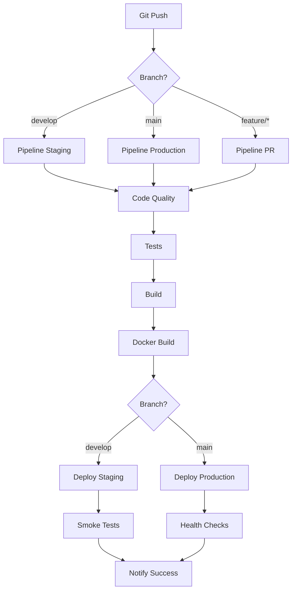

# 🔄 Pipeline CI/CD - VitalApp

## Índice

- [Introducción](#introducción)
- [Arquitectura del Pipeline](#arquitectura-del-pipeline)
- [Etapas del Pipeline](#etapas-del-pipeline)
- [Configuración](#configuración)
- [Ambientes](#ambientes)
- [Estrategia de Branching](#estrategia-de-branching)
- [Deployment](#deployment)
- [Rollback](#rollback)
- [Monitoring](#monitoring)

---

## Introducción

VitalApp implementa un pipeline completo de **CI/CD** (Continuous Integration / Continuous Deployment) utilizando **GitHub Actions** que automatiza todo el proceso desde el commit hasta el deployment en producción.

### Objetivos del Pipeline

- ✅ **Calidad de código**: Análisis estático y linting automático
- 🧪 **Testing automatizado**: Tests unitarios e integración
- 🔒 **Seguridad**: Escaneo de vulnerabilidades
- 🐳 **Containerización**: Build y push de imágenes Docker
- 🚀 **Deployment automático**: Deploy a staging y producción
- 📊 **Feedback rápido**: Notificaciones en tiempo real

### Beneficios

| Antes del Pipeline | Con Pipeline CI/CD |
|-------------------|-------------------|
| Deploy manual (días) | Deploy automático (minutos) |
| Errores en producción | Tests previenen errores |
| Sin control de versiones | Versionado automático |
| Documentación desactualizada | Docs siempre actualizadas |
| Comunicación limitada | Feedback automático |

---

## Arquitectura del Pipeline



---

## Etapas del Pipeline

### 1️⃣ Code Quality (Calidad de Código)

**Objetivo**: Garantizar estándares de código y seguridad básica.

**Acciones**:
- Ejecuta ESLint para validar estilo de código
- Ejecuta `npm audit` para detectar vulnerabilidades
- Verifica convenciones de naming y estructura

**Criterios de Éxito**:
- ✅ 0 errores de ESLint
- ✅ 0 vulnerabilidades críticas/altas
- ✅ Código sigue convenciones del proyecto

**Tiempo Promedio**: ~1 minuto

**Comando Manual**:
```bash
npm run lint
npm audit --audit-level=moderate
```

**Configuración**:
```yaml
code-quality:
  runs-on: ubuntu-latest
  steps:
    - uses: actions/checkout@v4
    - uses: actions/setup-node@v4
    - run: npm ci
    - run: npm run lint
    - run: npm audit --audit-level=moderate
```

---

### 2️⃣ Tests (Pruebas Automatizadas)

**Objetivo**: Validar funcionalidad mediante tests automatizados.

**Acciones**:
- Tests unitarios de todas las funciones
- Tests de integración de endpoints
- Generación de reporte de cobertura
- Matrix testing en múltiples versiones de Node

**Criterios de Éxito**:
- ✅ 100% de tests pasando
- ✅ Cobertura > 75%
- ✅ Compatible con Node 18.x y 20.x

**Tiempo Promedio**: ~2-3 minutos

**Comando Manual**:
```bash
npm test
npm test -- --coverage
```

**Métricas de Cobertura**:
```yaml
coverageThreshold:
  global:
    branches: 70%
    functions: 75%
    lines: 75%
    statements: 75%
```

**Configuración**:
```yaml
test:
  strategy:
    matrix:
      node-version: [18.x, 20.x]
  steps:
    - uses: actions/checkout@v4
    - uses: actions/setup-node@v4
    - run: npm ci
    - run: npm test
    - uses: codecov/codecov-action@v3
```

---

### 3️⃣ Build (Construcción)

**Objetivo**: Construir artefactos listos para deployment.

**Acciones**:
- Instala dependencias de producción
- Ejecuta scripts de build
- Genera artefactos
- Sube artefactos para uso posterior

**Criterios de Éxito**:
- ✅ Build exitoso sin errores
- ✅ Artefactos generados correctamente
- ✅ Tamaño de bundle optimizado

**Tiempo Promedio**: ~2 minutos

**Comando Manual**:
```bash
npm ci --production
npm run build
```

**Configuración**:
```yaml
build:
  needs: test
  steps:
    - uses: actions/checkout@v4
    - run: npm ci --production
    - run: npm run build
    - uses: actions/upload-artifact@v3
      with:
        name: vitalapp-build
        retention-days: 5
```

---

### 4️⃣ Docker Build & Push

**Objetivo**: Containerizar la aplicación y publicar imagen.

**Acciones**:
- Build de imagen Docker multi-stage
- Tagging automático con versionado semántico
- Push a GitHub Container Registry
- Cache de layers para builds más rápidos

**Criterios de Éxito**:
- ✅ Imagen Docker construida exitosamente
- ✅ Health checks funcionando
- ✅ Imagen optimizada en tamaño

**Tiempo Promedio**: ~3-4 minutos

**Tags Generados**:
- `latest` - Última versión estable
- `v1.0.0` - Versión semántica
- `main-abc1234` - Commit SHA

**Comando Manual**:
```bash
docker build -t vitalapp:latest .
docker push ghcr.io/tu-org/vitalapp:latest
```

**Configuración**:
```yaml
docker:
  needs: build
  if: github.ref == 'refs/heads/main'
  steps:
    - uses: docker/setup-buildx-action@v3
    - uses: docker/login-action@v3
    - uses: docker/build-push-action@v5
      with:
        push: true
        tags: |
          ghcr.io/${{ github.repository }}:latest
          ghcr.io/${{ github.repository }}:${{ github.sha }}
```

---

### 5️⃣ Deploy Staging

**Objetivo**: Desplegar automáticamente a ambiente de pruebas.

**Trigger**: Push a branch `develop`

**Acciones**:
- Descarga artefactos de build
- Deploy a servidor de staging
- Ejecuta smoke tests
- Notifica resultado

**Criterios de Éxito**:
- ✅ Deploy exitoso
- ✅ Smoke tests pasando
- ✅ Health checks respondiendo

**Tiempo Promedio**: ~2-3 minutos

**URL**: `https://staging.vitalapp.com`

**Smoke Tests**:
```bash
# Verificar health
curl -f https://staging.vitalapp.com/health

# Verificar API
curl -f https://staging.vitalapp.com/api/patients
```

**Configuración**:
```yaml
deploy-staging:
  needs: [build, docker]
  if: github.ref == 'refs/heads/develop'
  environment:
    name: staging
    url: https://staging.vitalapp.com
  steps:
    - run: echo "Deploying to staging..."
    - run: curl -f https://staging.vitalapp.com/health
```

---

### 6️⃣ Deploy Production

**Objetivo**: Desplegar a ambiente de producción.

**Trigger**: Push a branch `main` + Aprobación manual

**Acciones**:
- Descarga artefactos de build
- Espera aprobación manual (opcional)
- Deploy a servidores de producción
- Ejecuta health checks completos
- Crea release en GitHub
- Notifica a equipo

**Criterios de Éxito**:
- ✅ Aprobación manual recibida
- ✅ Deploy sin downtime
- ✅ Health checks OK
- ✅ Métricas normales

**Tiempo Promedio**: ~5 minutos

**URL**: `https://vitalapp.com`

**Health Checks**:
```bash
# Verificar salud
curl -f https://vitalapp.com/health

# Verificar disponibilidad
curl -f https://vitalapp.com/ready

# Verificar tiempo de respuesta
time curl https://vitalapp.com/api/patients
```

**Configuración**:
```yaml
deploy-production:
  needs: [build, docker]
  if: github.ref == 'refs/heads/main'
  environment:
    name: production
    url: https://vitalapp.com
  steps:
    - run: echo "Deploying to production..."
    - run: curl -f https://vitalapp.com/health
    - uses: actions/create-release@v1
```

---

## Configuración

### Variables de Ambiente

Configurar en GitHub: **Settings → Secrets and variables → Actions**

#### Repository Secrets

| Secret | Descripción | Ejemplo |
|--------|-------------|---------|
| `GITHUB_TOKEN` | Token automático | Auto-generado |
| `DOCKER_USERNAME` | Usuario Docker Hub | `vitalapp` |
| `DOCKER_PASSWORD` | Password Docker Hub | `***` |
| `STAGING_SSH_KEY` | SSH key para staging | `-----BEGIN...` |
| `PROD_SSH_KEY` | SSH key para producción | `-----BEGIN...` |

#### Environment Secrets (por ambiente)

**Staging**:
```
DB_HOST=staging-db.example.com
DB_PASSWORD=***
REDIS_URL=redis://staging-redis:6379
```

**Production**:
```
DB_HOST=prod-db.example.com
DB_PASSWORD=***
REDIS_URL=redis://prod-redis:6379
```

### Configuración de Ambientes

**GitHub → Settings → Environments**

#### Staging
- ✅ Auto-deploy desde `develop`
- ❌ Sin protección
- 🔄 Retention: 7 días

#### Production
- ✅ Requiere revisión manual
- ✅ Protección de branch `main`
- ✅ Mínimo 1 aprobador
- 🔄 Retention: 30 días

---

## Ambientes

### Development (Local)

**Propósito**: Desarrollo activo local

**Acceso**: 
- URL: `http://localhost:3000`
- DB: Local o Docker

**Características**:
- Hot reload activado
- Logs verbosos
- Sin optimizaciones
- Datos de prueba

**Comandos**:
```bash
npm run dev
docker-compose up -d
```

---

### Staging (Pre-producción)

**Propósito**: Testing y QA antes de producción

**Acceso**:
- URL: `https://staging.vitalapp.com`
- Deploy: Automático desde `develop`

**Características**:
- Réplica de producción
- Datos sintéticos
- Testing de integración
- Performance testing

**Deploy**:
```bash
git checkout develop
git merge feature/nueva-funcionalidad
git push origin develop
# Deploy automático se activa
```

---

### Production (Producción)

**Propósito**: Ambiente productivo para usuarios finales

**Acceso**:
- URL: `https://vitalapp.com`
- Deploy: Manual con aprobación desde `main`

**Características**:
- Alta disponibilidad
- Datos reales
- Monitoreo 24/7
- Backups automáticos
- Rollback rápido

**Deploy**:
```bash
git checkout main
git merge develop
git push origin main
# Esperar aprobación manual
# Deploy se ejecuta tras aprobación
```

---

## Estrategia de Branching

### Git Flow Simplificado

```
main (producción)
  ↑
  └── develop (staging)
        ↑
        ├── feature/nombre-feature
        ├── bugfix/nombre-bug
        └── hotfix/nombre-hotfix
```

### Tipos de Branches

#### `main`
- Código en producción
- Solo merges desde `develop`
- Protegido (no commits directos)
- Cada merge = release

#### `develop`
- Código en staging
- Branch de integración
- Deploy automático a staging
- Base para features

#### `feature/*`
- Nuevas funcionalidades
- Base: `develop`
- Merge: `develop` (via PR)
- Ejemplo: `feature/alertas-push`

#### `bugfix/*`
- Corrección de bugs
- Base: `develop`
- Merge: `develop` (via PR)
- Ejemplo: `bugfix/validacion-email`

#### `hotfix/*`
- Correcciones urgentes
- Base: `main`
- Merge: `main` y `develop`
- Ejemplo: `hotfix/security-patch`

### Flujo de Trabajo

#### Nueva Feature

```bash
# 1. Crear branch desde develop
git checkout develop
git pull origin develop
git checkout -b feature/nueva-funcionalidad

# 2. Desarrollar y commitear
git add .
git commit -m "feat: agregar nueva funcionalidad"

# 3. Push y crear PR
git push origin feature/nueva-funcionalidad
# Crear PR en GitHub: feature/nueva-funcionalidad → develop

# 4. Pipeline ejecuta automáticamente:
#    - Code quality ✓
#    - Tests ✓
#    - Build ✓

# 5. Code review y merge
# 6. Deploy automático a staging

# 7. Validar en staging
curl https://staging.vitalapp.com/health

# 8. Crear PR a main
# PR: develop → main

# 9. Aprobación y merge
# 10. Deploy a producción (manual)
```

#### Hotfix de Emergencia

```bash
# 1. Crear branch desde main
git checkout main
git pull origin main
git checkout -b hotfix/critical-bug

# 2. Corregir y commitear
git add .
git commit -m "fix: corregir bug crítico"

# 3. Merge a main
git checkout main
git merge hotfix/critical-bug
git push origin main

# 4. Merge a develop
git checkout develop
git merge hotfix/critical-bug
git push origin develop

# 5. Deploy inmediato a producción
```

---

## Deployment

### Proceso de Deploy Staging

```yaml
1. Developer → Push a 'develop'
2. GitHub Actions → Inicia pipeline
3. Code Quality → ✓ Pasa
4. Tests → ✓ Pasan
5. Build → ✓ Exitoso
6. Docker → ✓ Imagen creada
7. Deploy Staging → ✓ Desplegado
8. Smoke Tests → ✓ Pasan
9. Notificación → ✅ Deploy exitoso
```

### Proceso de Deploy Production

```yaml
1. Developer → PR de develop a main
2. Code Review → Aprobación
3. Merge a main
4. GitHub Actions → Inicia pipeline
5. Code Quality → ✓ Pasa
6. Tests → ✓ Pasan
7. Build → ✓ Exitoso
8. Docker → ✓ Imagen creada
9. Espera Aprobación → ⏸️ Manual
10. Aprobador → ✅ Aprueba
11. Deploy Production → ✓ Desplegado
12. Health Checks → ✓ Pasan
13. Create Release → ✓ v1.0.x
14. Notificación → ✅ Deploy exitoso
```

### Checklist Pre-Deploy

Antes de deployar a producción, verificar:

- [ ] Todos los tests pasan
- [ ] Cobertura > 75%
- [ ] Sin vulnerabilidades críticas
- [ ] Staging funcionando correctamente
- [ ] Backup de BD realizado
- [ ] Equipo notificado
- [ ] Plan de rollback listo
- [ ] Documentación actualizada
- [ ] Performance testing OK
- [ ] Security scan OK

---

## Rollback

### Estrategia de Rollback

VitalApp implementa múltiples estrategias de rollback para recuperación rápida:

#### 1. Rollback Docker

```bash
# Listar imágenes disponibles
docker images | grep vitalapp

# Rollback a versión anterior
docker pull ghcr.io/tu-org/vitalapp:v1.0.5
docker stop vitalapp
docker run -d --name vitalapp ghcr.io/tu-org/vitalapp:v1.0.5
```

#### 2. Rollback Git

```bash
# Ver commits recientes
git log --oneline -10

# Revertir último commit
git revert HEAD
git push origin main

# O revertir a commit específico
git reset --hard abc1234
git push --force origin main
```

#### 3. Rollback via GitHub

1. GitHub → Actions → Deploy Production
2. Seleccionar deployment exitoso anterior
3. Click en "Re-run jobs"
4. Aprobar re-deployment

#### 4. Rollback de Base de Datos

```bash
# Restaurar backup
docker-compose exec postgres psql -U vitalapp_user vitalapp < backup-20251004.sql

# O usar scripts de migración
npm run migrate:rollback
```

### Tiempo de Rollback

| Método | Tiempo Estimado |
|--------|----------------|
| Docker tag anterior | ~1 minuto |
| Git revert | ~3 minutos |
| GitHub re-run | ~5 minutos |
| DB restore | ~10 minutos |

### Procedimiento de Emergencia

```bash
# 1. Detectar problema
curl https://vitalapp.com/health  # FAIL

# 2. Activar rollback inmediato
docker pull ghcr.io/tu-org/vitalapp:previous-stable
docker-compose up -d --force-recreate

# 3. Verificar recuperación
curl https://vitalapp.com/health  # OK

# 4. Notificar a equipo
# Slack/Email: "Rollback ejecutado exitosamente"

# 5. Post-mortem
# Analizar causa raíz y prevenir
```

---

## Monitoring

### Métricas del Pipeline

Monitorear en GitHub Actions:

- ⏱️ **Tiempo de ejecución**: < 10 minutos
- ✅ **Success rate**: > 95%
- 🔴 **Failed builds**: < 5%
- 📈 **Frequency**: 5-10 deploys/día

### Health Checks

```bash
# Staging
watch -n 5 'curl -s https://staging.vitalapp.com/health | jq'

# Production
watch -n 5 'curl -s https://vitalapp.com/health | jq'
```

### Alertas

Configurar alertas para:

- ❌ Pipeline fallido
- ⚠️ Tests con baja cobertura
- 🔒 Vulnerabilidades detectadas
- 🐌 Deploy > 10 minutos
- 🔴 Health checks fallando

### Dashboards

Crear dashboards con:

- GitHub Actions metrics
- Deployment frequency
- Lead time for changes
- Mean time to recovery (MTTR)
- Change failure rate

---

## Mejores Prácticas

1. **Commits pequeños y frecuentes**
2. **Tests antes de push**
3. **Code review obligatorio**
4. **Staging siempre antes de producción**
5. **Monitoreo post-deploy**
6. **Documentar cambios**
7. **Backup antes de cambios grandes**
8. **Rollback plan siempre listo**

---

## Recursos

- [GitHub Actions Docs](https://docs.github.com/en/actions)
- [Docker Best Practices](https://docs.docker.com/develop/dev-best-practices/)
- [DevOps Best Practices](https://www.atlassian.com/devops)

---

**Última actualización**: Octubre 2025  
**Mantenido por**: Equipo DevOps - Salud Vital